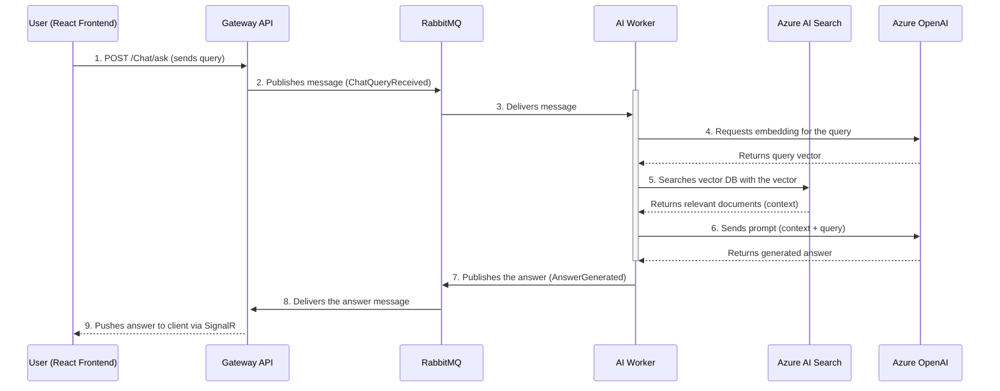

# AdriaticDreamsAI - AI-Powered Travel Agent Chatbot

AdriaticDreamsAI is a fully functional, AI-powered chatbot designed for a fictional travel agency. It leverages a modern microservices architecture and the Retrieval-Augmented Generation (RAG) pattern to answer user queries based on a knowledge base of apartment listings.

The entire system is containerized with Docker and features a real-time frontend built with React, TypeScript, and SignalR for a seamless, interactive user experience.

## Architecture

The application follows an asynchronous, message-driven architecture to ensure scalability and resilience. The data flow for a user query is as follows:



## Technology Stack

This project utilizes a modern stack of technologies to create a robust and scalable AI solution.

  * **Backend:**

      * .NET 8 / C\#
      * ASP.NET Core Web API
      * .NET Worker Service

  * **AI & Machine Learning:**

      * **Microsoft Semantic Kernel:** An AI orchestration SDK for managing prompts, memory, and AI models.
      * **Azure OpenAI:**
          * `gpt-4o` for chat completions and instruction following.
          * `text-embedding-3-small` for generating vector embeddings.
      * **Azure AI Search:** Used as a vector database for long-term memory and performing semantic searches.
      * **Retrieval-Augmented Generation (RAG):** The core pattern used to ground the AI's responses in factual data.

  * **Messaging & Asynchronous Communication:**

      * **MassTransit:** A high-level messaging library for .NET.
      * **RabbitMQ:** A robust, open-source message broker.

  * **Frontend:**

      * **React** with **TypeScript + SWC** (built using Vite).
      * **SignalR:** For real-time, bi-directional communication between the server and the client.

  * **Containerization:**

      * **Docker & Docker Compose:** All services are fully containerized for consistent development and easy deployment.

## Current Features

  * **Asynchronous Processing:** The API Gateway immediately accepts user queries and offloads the intensive AI processing to the background worker via RabbitMQ, ensuring the API remains responsive.
  * **Retrieval-Augmented Generation (RAG):** The AI Worker first retrieves relevant information from a knowledge base (stored in Azure AI Search) before generating an answer, which prevents hallucinations and ensures responses are based on provided data.
  * **Real-time Chat Experience:** The final answer from the AI is pushed back to the user's browser in real-time using SignalR, creating a fluid and interactive chat experience.
  * **Secure Configuration:** API keys and other secrets are managed using environment variables, keeping them out of the source code.
  * **Structured Knowledge Base:** The system ingests data from a structured `apartments.json` file for clean, reliable data processing and embedding.

## How to Run Locally

### Prerequisites

  * .NET 8 SDK
  * Docker Desktop
  * Node.js and npm

### 1\. Azure Setup

You need an active Azure subscription with the following resources created:

  * An **Azure OpenAI** resource with deployments for `gpt-4o` (named "chat") and `text-embedding-3-small` (named "embedding").
  * An **Azure AI Search** resource.

### 2\. Configuration

1.  In the root directory of the project, create a new file named `.env`. This file will hold your secret keys and will be ignored by Git.

2.  Copy the content from `.env.example` into your new `.env` file and fill in the values with your actual keys and endpoints from the Azure Portal.

    **.env.example**

    ```
    # Azure OpenAI Configuration
    AI__AzureOpenAI__Endpoint="YOUR_AZURE_OPENAI_ENDPOINT"
    AI__AzureOpenAI__ApiKey="YOUR_AZURE_OPENAI_API_KEY"

    # Azure AI Search Configuration
    AI__AzureAISearch__Endpoint="YOUR_AZURE_AI_SEARCH_ENDPOINT"
    AI__AzureAISearch__ApiKey="YOUR_AZURE_AI_SEARCH_API_KEY"
    ```

3.  Ensure your `docker-compose.yml` is configured to use these environment variables. The `ai-worker` service should look like this:

    ```yaml
    # docker-compose.yml
    ai-worker:
      container_name: ai-worker
      build:
        context: .
        dockerfile: AI.Worker/Dockerfile
      env_file:
        - .env # This line tells Docker Compose to load variables from the .env file
      depends_on:
        rabbitmq:
          condition: service_healthy
    ```

### 3\. Running the Application

1.  **Start the backend services:** Open a terminal in the root directory and run:

    ```bash
    docker-compose up --build
    ```

    This will build the Docker images and start the Gateway API, AI Worker, and RabbitMQ containers. The `DataIngestionService` will run once on startup to populate your Azure AI Search index.

2.  **Start the frontend application:** Open a **new terminal**, navigate to the `frontend` directory, and run:

    ```bash
    npm install
    npm run dev
    ```

    You can now access the chat application in your browser at `http://localhost:5173`.

## Future Improvements & Roadmap

  * **Deployment to Azure:**

      * Migrate the Docker containers to **Azure Container Apps**.
      * Replace the local RabbitMQ container with a cloud-native **Azure Service Bus**.
      * Store the Docker images in an **Azure Container Registry (ACR)**.
      * Manage production secrets securely using **Azure Key Vault**.

  * **Advanced Agent Capabilities:**

      * **Add More Tools (Plugins):** Extend the AI Worker's capabilities by adding more Semantic Kernel plugins. For example, a `BookingPlugin` with functions like `CheckAvailability(apartmentId, date)` or `MakeReservation(...)`.
      * **Function Calling/Planning:** Implement a planner to allow the AI to chain multiple tools together to answer more complex queries (e.g., "Find me an available apartment for 4 people in Split that allows pets and book it for me.").

  * **Enhanced Frontend Experience:**

      * Implement user-specific chat history.
      * Add a "typing..." indicator while the AI Worker is processing the request.
      * Improve error handling and display user-friendly error messages on the UI.
